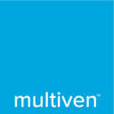

# Multiven Smart-Contracts

 

## Multicoin Contract

The multicoin contract is a standard ERC20 token with some added behavior to manage the supply of tokens.

 - The contract is owned.
 - The `owner` of the contract can attribute tokens.
 - The ownership of the contract can be transferred.
 - Tokens are `frozen` by default, it means they can be attributed but not traded once attributed.
 - Some addresses are allowed to bypass the freeze (i.e. the MultivenICO Contract described below)
 - The token can be marked `live`, once marked `live` the token can be traded between everybody. Also, once marked `live`, it cannot be marked `frozen` again.

## The Multiven ICO Contract

The ICO is made of 4 rounds, and the contract is here to enforce the token distribution while the rounds are going. You can find more details about the ICO itself [in the whitepaper](https://multiven.io/wp-content/uploads/2018/02/multiven_WhitePaper-15Feb2018.pdf).

## Playing with the contract

This contract leverage the Truffle Suite, and you can simply do a `yarn install` to setup the environement.

### Testing the contract

Run `yarn run test`

### Checking the coverage of the tests

Run `yarn run test-coverage`
